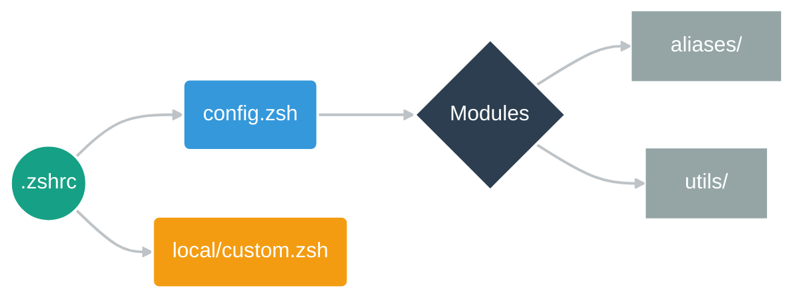
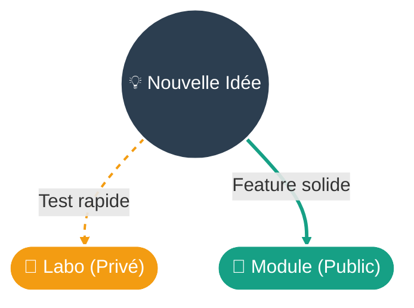

<div align="center">


[](https://github.com/yanix2445/zsh-boost)
[](LICENSE)
[](https://github.com/yanis)

</div>

<br/>

<div align="center">

| | Section | Description |
|:---:|:---|:---|
| ⚡ | [**Installation**](#-installation) | Prêt en 1 minute |
| 🏗️ | [**Architecture**](#-architecture) | Structure du projet |
| 🎛️ | [**Configuration**](#-configuration) | Activer/désactiver les modules |
| 🛠️ | [**Personnalisation**](#-personnalisation) | Créer tes propres outils |
| 🚨 | [**Dépannage**](#-dépannage) | Résoudre les problèmes |
| 📜 | [**Licence**](#-licence) | Apache 2.0 |

</div>

<br/>

---

<br/>

## ⚡ Installation

<table>
<tr>
<td>

```zsh
git clone https://github.com/yanix2445/zsh-boost.git
cd zsh-boost && ./install.sh
```

</td>
<td width="50%">

**L'installateur configure tout :**

- ✅ Homebrew (si manquant)
- ✅ Outils CLI modernes
- ✅ Police Nerd Font
- ✅ Symlink `.zshrc`

</td>
</tr>
</table>

<br/>

## 🏗️ Architecture

<div align="center">



</div>

<br/>

<div align="center">

| Fichier | Accès | Rôle |
|:--------|:-----:|:-----|
| `.zshrc` | ⛔ | Point d'entrée — **ne pas modifier** |
| `config.zsh` | 🎛️ | **Ta configuration** — modules, thème, plugins |
| `modules/` | ✏️ | Aliases et utils activables |
| `local/custom.zsh` | 🔥 | **Ton espace** — ignoré par Git |

</div>

<br/>

---

<br/>

## 🎛️ Configuration

Modifie `config.zsh` pour activer ou désactiver les modules :

```zsh
ZSH_MODULES=(
    core/omz              # 🔒 Oh My Zsh
    aliases/navigation    # ✅ Actif
    # aliases/docker      # ❌ Désactivé
    utils/myip            # ✅ Actif
)
```

<br/>

### 🔥 Top Features

<div align="center">

<table>
<tr>
<td>

### 🛠️ Utils

| Commande | Description |
|:---------|:------------|
| `myip` | IP locale/publique |
| `mkcd` | Créer + entrer dossier |
| `bak` | Backup horodaté |
| `trash` | Corbeille sécurisée |
| `ports` | Ports ouverts |
| `up` | Mise à jour système |

</td>
<td>

### 🔀 Aliases

| Commande | Description |
|:---------|:------------|
| `ll` | Liste avec icônes |
| `grep` | Recherche (ripgrep) |
| `cat` | Affichage coloré |
| `rld` | Recharger la config |
| `..` | Remonter d'un niveau |
| `cls` | Effacer le terminal |

</td>
</tr>
</table>

</div>

<br/>

---

<br/>

## 🛠️ Personnalisation

<div align="center">

<i>Choisis ton approche pour étendre ZSH Boost</i>

<br/>



<br/>

<table>
<tr>
<td width="50%" valign="top">

### 🧪 Le Labo
**Pour tes secrets & tests**

Tout ce que tu mets dans `local/custom.zsh` reste sur ta machine (GitIgnored).

<br/>

> **Parfait pour :**
> - 🔑 Tokens & Clés API
> - 🗑️ Alias jetables
> - 🚧 Tests en vrac

</td>
<td width="50%" valign="top">

### 🧱 L'Atelier
**Pour tes outils durables**

Crée un module propre dans `modules/` et active-le dans `config.zsh`.

<br/>

> **Workflow :**
> 1. 📝 Créer `modules/aliases/mon-outil.zsh`
> 2. 🔌 Ajouter `aliases/mon-outil` dans `config.zsh`
> 3. ♻️ Lancer `rld`

</td>
</tr>
</table>

</div>

<br/>

---

<br/>

## 🚨 Dépannage

| Problème | Solution |
|:---------|:---------|
| Icônes `□□□` | Installer **FiraCode Nerd Font** |
| Commande introuvable | Vérifier `config.zsh` puis `rld` |
| Terminal lent | Désactiver les modules inutilisés |

<br/>

<details>
<summary><strong>🔧 Réinitialisation</strong></summary>

```bash
rm -rf ~/.zcompdump* && exec zsh
```

</details>

<br/>

---

<br/>

<div align="center">


**Made with 💚 by [@yanix2445](https://github.com/yanix2445)**

</div>
