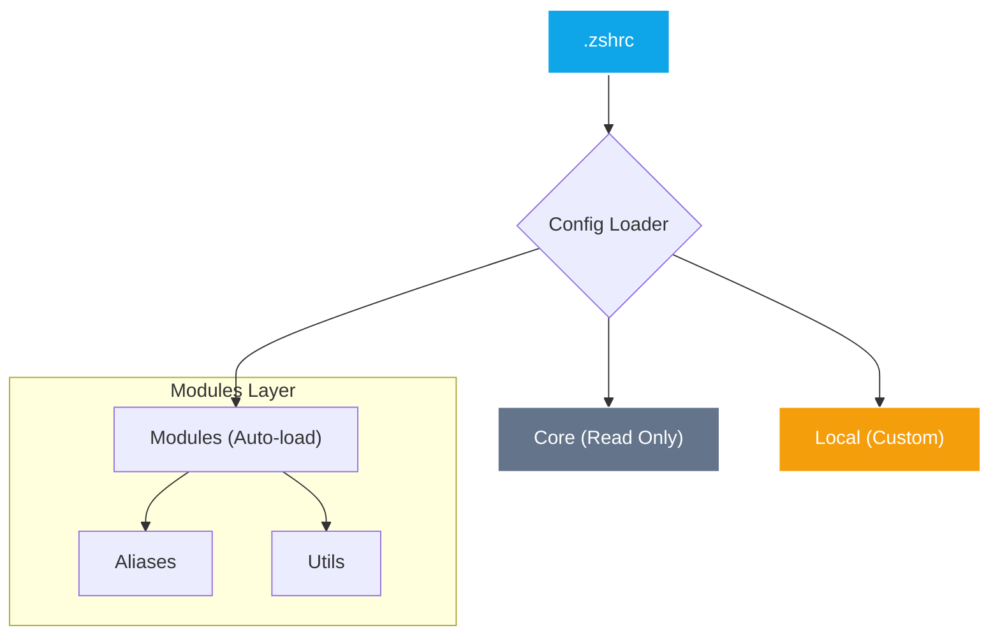

<div align="center">


<br/>

[](https://github.com/yanix2445/zsh-boost)
[](LICENSE)
[](https://github.com/yanis)

<br/>


### 🚀 L'expérience ultime du terminal macOS

---
</div>

---

## 📚 Table des Matières
- [⚡ Installation](#-installation)
- [🏗️ Architecture](#️-architecture)
- [🎛️ Configuration](#️-configuration)
- [🛠️ Personnalisation](#️-personnalisation)
- [🚨 Dépannage](#-dépannage)
- [📜 Licence](#-licence)

---

## ⚡ Installation

Une seule commande pour transformer votre terminal :

```zsh
git clone https://github.com/yanix2445/zsh-boost.git && cd zsh-boost && ./install.sh
```

> [!TIP]
> **Zsh Boost** installe automatiquement vos dépendances via Homebrew (eza, bat, fd, rg, fzf, zoxide) et configure la police Nerd Font pour un affichage optimal.

---

## 🏗️ Architecture Smart

Le projet est conçu pour être à la fois **robuste** (core protégé) et **flexible** (modules interchangeables).



---

## 🎛️ Configuration Granulaire

Le fichier `config.zsh` est votre centre de contrôle. Activez ou désactivez les fonctionnalités en une seule ligne.

### 🔥 Le Top 10 des Features (Confondu)

| Type | Commande | Description |
| :--- | :--- | :--- |
| 🐚 | `ll` | Liste enrichie (eza) avec icônes et git status |
| 🔍 | `grep` | Recherche ultra-rapide via Ripgrep |
| 📦 | `up` | Mise à jour globale (System, Brew, OMZ) |
| 🌐 | `myip` | Affiche instantanément vos IPs (Local/Public) |
| 📁 | `mkcd` | Crée un dossier et s'y déplace immédiatement |
| 🧹 | `trash` | Suppression sécurisée vers la corbeille macOS |
| 📄 | `cat` | Lecture avec coloration syntaxique (bat) |
| 🛠️ | `ports` | Visualisation interactive des ports occupés |
| 💾 | `bak` | Création de backup horodaté en un clic |
| 🔄 | `rld` | Rechargement à chaud de votre configuration |

---

## 🛠️ Personnalisation

Le système respecte votre flux de travail :

1.  **Tests Rapides** : Utilisez `local/custom.zsh` pour vos expérimentations (ignoré par Git).
2.  **Modules Dédiés** : Ajoutez vos fichiers `.zsh` dans `modules/aliases/` ou `modules/utils/`.
3.  **Activation** : Déclarez-les simplement dans le tableau `ZSH_MODULES` de votre `config.zsh`.

> [!IMPORTANT]
> Ne modifiez jamais le dossier `core/` pour garantir la compatibilité avec les futures mises à jour du moteur.

---

## 🚨 Dépannage

| Symptôme | Solution |
| :--- | :--- |
| **Icônes manquantes** | Assurez-vous d'utiliser une **Nerd Font** (FiraCode recommandée). |
| **Commandes non trouvées** | Vérifiez que le module est bien décommenté dans `config.zsh`. |
| **Lenteur** | Lancez `up` pour optimiser les caches de complétion. |

---

## 📜 Licence

Distribué sous la licence **Apache 2.0**. Voir le fichier [LICENSE](LICENSE) pour plus de détails.

<div align="center">

**[ZSH Boost](https://github.com/yanix2445/zsh-boost) — Propulsé par la passion du code.**

</div>
