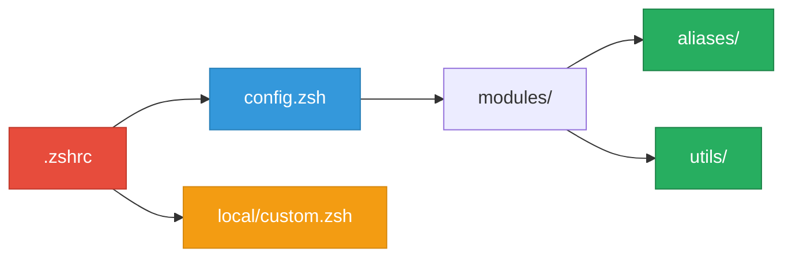

<h1 align="center">
  <br/>
  🚀 ZSH Boost
  <br/>
</h1>

<p align="center">
  <strong>Configuration ZSH modulaire pour développeurs macOS</strong>
</p>

<p align="center">
  
  
  <a href="LICENSE"></a>
</p>

---

## 📚 Sommaire

- [Installation](#-installation)
- [Architecture](#️-architecture)
- [Configuration](#️-configuration)
- [Personnalisation](#️-personnalisation)
- [Dépannage](#-dépannage)
- [Licence](#-licence)

---

## ⚡ Installation

```bash
git clone https://github.com/yanix2445/zsh-boost.git ~/.config/zsh-boost
cd ~/.config/zsh-boost && ./install.sh
```

L'installateur configure tout : Homebrew, outils CLI, police, symlink. **C'est prêt.**

---

## 🏗️ Architecture



<br/>

| Fichier | Accès | Description |
|:--------|:-----:|:------------|
| `.zshrc` | ⛔ | Point d'entrée — ne pas modifier |
| `config.zsh` | 🎛️ | **Ton fichier de configuration** |
| `modules/aliases/` | ✏️ | Raccourcis de commandes |
| `modules/utils/` | ✏️ | Fonctions utilitaires |
| `local/custom.zsh` | 🔥 | Espace perso (ignoré par Git) |

---

## 🎛️ Configuration

Modifie `config.zsh` pour activer ou désactiver des modules :

```zsh
ZSH_MODULES=(
    core/omz              # 🔒 Oh My Zsh

    aliases/navigation    # ✅ ls, ll, .., rld
    aliases/search        # ✅ grep, find, cat
    # aliases/docker      # ❌ Désactivé

    utils/myip            # ✅ Afficher IP
    utils/backup          # ✅ Backup fichiers
    # utils/fkill         # ❌ Désactivé
)
```

> **Appliquer :** `rld` ou `exec zsh`

<br/>

### Highlights

| Alias | Action |
|:------|:-------|
| `ll` | Liste détaillée avec icônes |
| `grep` | Recherche ultra-rapide |
| `cat` | Affichage coloré |
| `rld` | Recharger la config |

| Utilitaire | Action |
|:-----------|:-------|
| `myip` | IP locale et publique |
| `mkcd` | Créer + entrer dossier |
| `bak` | Backup horodaté |
| `trash` | Corbeille sécurisée |
| `extract` | Décompresser tout |
| `serve` | Serveur HTTP local |
| `ports` | Lister ports ouverts |
| `fkill` | Tuer un processus |
| `up` | Mise à jour système |

---

## 🛠️ Personnalisation

**1. Teste** dans `local/custom.zsh` :
```zsh
alias monalias="ma-commande"
```

**2. Si ça marche**, crée un module dans `modules/aliases/` ou `modules/utils/`.

**3. Ajoute** dans `config.zsh` et recharge avec `rld`.

> [!TIP]
> `local/custom.zsh` est ignoré par Git — idéal pour les secrets et tests.

---

## 🚨 Dépannage

| Problème | Solution |
|:---------|:---------|
| Icônes cassées | Installer **FiraCode Nerd Font** |
| Commande introuvable | Vérifier `config.zsh` puis `rld` |
| Terminal lent | Désactiver les modules inutilisés |

```bash
# Réinitialiser
rm -rf ~/.zcompdump* && exec zsh
```

---

## 📜 Licence

**Apache 2.0** — Utilisation libre, modification, distribution, usage commercial.

[Voir la licence](LICENSE)

---

<div align="center">
  <sub>Made by <a href="https://github.com/yanix2445">@yanix2445</a></sub>
</div>
