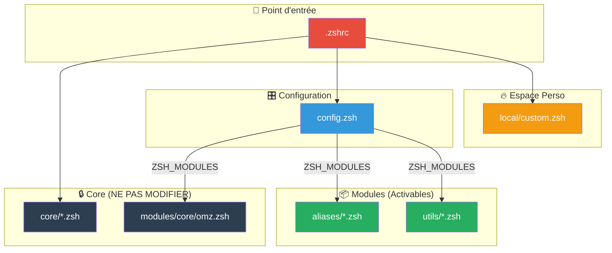
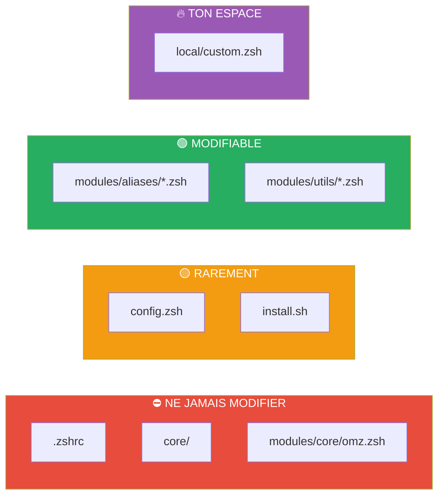
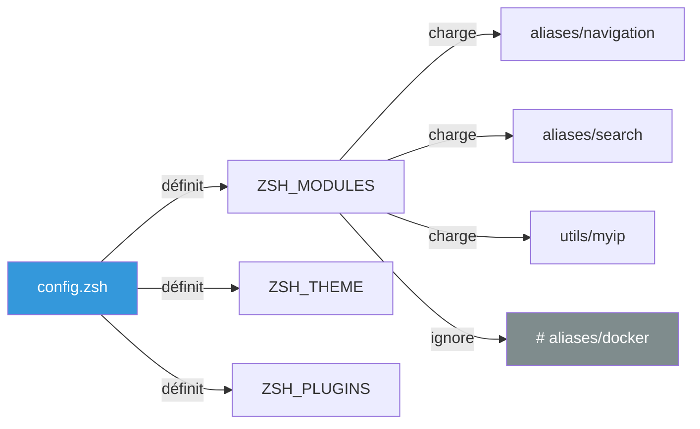
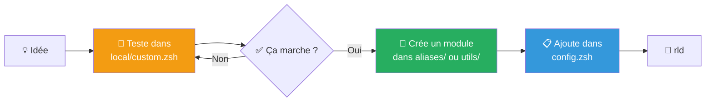

<h1 align="center">
  
  <br/>
  ZSH Boost
</h1>

<p align="center">
  <strong>Configuration ZSH modulaire pour développeurs macOS</strong>
</p>

<p align="center">
  <a href="#-installation"></a>
  
  
  <a href="LICENSE"></a>
</p>

<br/>

<p align="center">
  <code>Démarrage ultra-rapide</code> · <code>100% modulaire</code> · <code>Outils modernes</code>
</p>

---

## 📚 Table des Matières

| Section | Description |
|:--------|:------------|
| [⚡ Installation](#-installation) | Installer ZSH Boost en 1 minute |
| [🏗️ Architecture](#️-architecture) | Structure du projet et flux de données |
| [🎛️ Configuration](#️-configuration) | Activer/désactiver les modules |
| [🛠️ Personnalisation](#️-personnalisation) | Ajouter tes propres alias et fonctions |
| [🚨 Dépannage](#-dépannage) | Résoudre les problèmes courants |
| [📜 Licence](#-licence) | Droits d'utilisation Apache 2.0 |

---

## ⚡ Installation

```bash
git clone https://github.com/yanix2445/zsh-boost.git ~/.config/zsh-boost
cd ~/.config/zsh-boost && ./install.sh
```

> [!TIP]
> L'installateur interactif configure **tout automatiquement** :
> Homebrew → Outils CLI → Police Nerd Font → Symlink → Prêt ! 🎉

<details>
<summary><strong>📋 Prérequis</strong></summary>

| Requis | Version | Vérifier |
|:-------|:--------|:---------|
| macOS | 14+ (Sonoma) | `sw_vers` |
| Zsh | 5.9+ | `zsh --version` |
| Git | 2.x+ | `git --version` |

</details>

---

## 🏗️ Architecture

### Vue d'ensemble



### Niveaux d'accès



### Structure des fichiers

```
zsh-boost/
├── .zshrc                    # ⛔ Point d'entrée (ne pas toucher)
├── config.zsh                # 🎛️ TON fichier de configuration
│
├── core/                     # ⛔ Variables système
│
├── modules/
│   ├── core/omz.zsh          # ⛔ Oh My Zsh
│   ├── aliases/              # 🟢 Tes raccourcis
│   └── utils/                # 🟢 Tes fonctions
│
├── local/custom.zsh          # 🔥 Secrets & tests
│
└── install.sh                # Script d'installation
```

---

## 🎛️ Configuration

### Le fichier `config.zsh`

C'est le **seul fichier que tu dois modifier** pour contrôler ta configuration.



### Activer / Désactiver un module

```zsh
# config.zsh

typeset -a ZSH_MODULES
ZSH_MODULES=(
    core/omz                # 🔒 Toujours actif

    # ALIASES — Commente avec # pour désactiver
    aliases/navigation      # ✅ Actif
    aliases/search          # ✅ Actif
    # aliases/docker        # ❌ Désactivé

    # UTILS — Commente avec # pour désactiver
    utils/myip              # ✅ Actif
    # utils/fkill           # ❌ Désactivé
)
```

> [!IMPORTANT]
> Après modification, **recharge** avec `rld` ou `exec zsh`.

### Top 6 Aliases inclus

| Alias | Description |
|:------|:------------|
| `ll` | Liste détaillée avec icônes et git status |
| `..` `...` | Remonter de 1/2/3 niveaux |
| `grep` | Recherche ultra-rapide (ripgrep) |
| `find` | Recherche fichiers (fd) |
| `cat` | Affichage coloré (bat) |
| `rld` | Recharger la configuration |

### Top 10 Utils inclus

| Utilitaire | Description |
|:-----------|:------------|
| `myip` | Afficher IP locale et publique |
| `mkcd` | Créer et entrer dans un dossier |
| `bak` | Backup horodaté d'un fichier |
| `trash` | Envoyer à la corbeille (sécurisé) |
| `extract` | Décompresser n'importe quel format |
| `serve` | Lancer un serveur HTTP local |
| `ports` | Lister les ports ouverts (interactif) |
| `fkill` | Tuer un processus (interactif) |
| `json` | Formater du JSON coloré |
| `up` | Mise à jour complète du système |

---

## 🛠️ Personnalisation

### Workflow recommandé



### Ajouter un alias

1. **Teste** dans `local/custom.zsh` :
   ```zsh
   alias monalias="ma-commande"
   ```

2. **Si ça marche**, crée `modules/aliases/custom.zsh` et ajoute-le dans `config.zsh`.

### Ajouter une fonction

1. **Teste** dans `local/custom.zsh` :
   ```zsh
   mafonction() {
       echo "Hello $1"
   }
   ```

2. **Si ça marche**, crée `modules/utils/mafonction.zsh` et ajoute-le dans `config.zsh`.

### Stocker des secrets

> [!CAUTION]
> **Ne jamais commit de secrets !**

Le fichier `local/custom.zsh` est **ignoré par Git**. Utilise-le pour :

```zsh
# local/custom.zsh
export GITHUB_TOKEN="ghp_xxxx"
export OPENAI_API_KEY="sk-xxxx"
```

---

## 🚨 Dépannage

### Problèmes courants

| Symptôme | Solution |
|:---------|:---------|
| Icônes cassées `□□□` | Installe **FiraCode Nerd Font** dans les préférences du terminal |
| Commande introuvable | Vérifie `config.zsh` puis tape `rld` |
| `⚠️ Module introuvable` | Le chemin ne doit pas inclure `.zsh` |
| Terminal lent | Désactive les modules inutilisés |

### Réinitialisation

```bash
rm -rf ~/.zcompdump* && exec zsh
```

<details>
<summary><strong>🔧 Réinitialisation complète</strong></summary>

```bash
# Supprimer les caches
rm -rf ~/.zcompdump* ~/.oh-my-zsh/cache/*

# Relancer l'installateur
cd ~/.config/zsh-boost && ./install.sh
```

</details>

---

## 📜 Licence

<table>
<tr>
<td width="50%">

### ✅ Autorisé

- Utiliser librement
- Modifier le code
- Distribuer
- Usage commercial
- Breveter tes modifications

</td>
<td width="50%">

### 📝 Conditions

- Conserver les notices de copyright
- Indiquer les modifications
- Inclure la licence Apache 2.0

</td>
</tr>
</table>

> [!NOTE]
> La licence **Apache 2.0** inclut une protection anti-brevet automatique.

📄 [Voir la licence complète](LICENSE)

---

<div align="center">

**[@yanix2445](https://github.com/yanix2445)** · **ZSH Boost** 🚀

</div>
